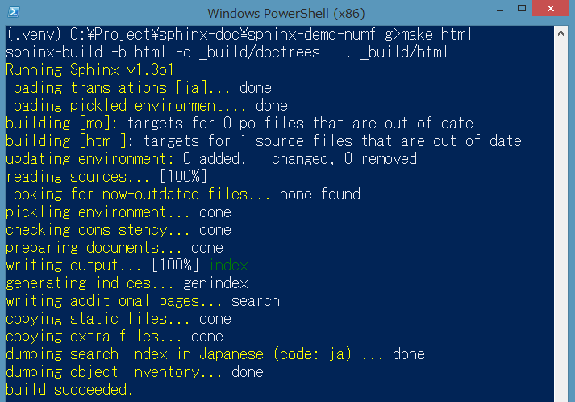

======================
Welcome to Sphinx-1.3
======================

.. s6:: styles

   'h1': {textAlign:'center', margin:'20% auto', fontSize:'200%'}


おまえだれよ
========================


http://about.me/shimizukawa, @shimizukawa


* Sphinxの共同メンテナ (2011-)
* Sphinx-Users JP 2014 副会長/会計
* 共著書・共訳書

  * Sphinxをはじめよう (2013)
  * Pythonプロフェッショナルプログラミング (2012)
  * エキスパートPythonプログラミング (2010)


.. figure:: images/book-pypro.png

.. figure:: images/book-epp.jpg

.. s6:: styles

   'div[0]': {width:'15%', position:'absolute', top:'0', right:'1em'},
   'ul': {fontSize:'70%'},
   'ul/li[2]/ul': {display:'none'},
   'div[1]': {width:'23%', position:'absolute', bottom:'0', left:'1em'},
   'div[2]': {width:'23%', position:'absolute', bottom:'0', left:'6.5em'},
   'div[3]': {width:'23%', position:'absolute', bottom:'0', right:'1em'},

.. s6:: effect slide


Sphinx-1.3リリース
====================

.. s6:: styles

   'h2': {textAlign:'center', margin:'30% auto', fontSize:'150%'}


Sphinx-1.3b1 リリース
======================

* 2014/10/10 (JST) リリース
* 1.2リリースから10か月
* **11個** の 非互換性
* **35個** の 新機能
* **27個** の バグ修正

.. s6:: effect slide

開発に貢献してくれた日本人
===========================

* 小宮健(@tk0miya)
* 若山しろう(@r_rudi)
* 熊谷章治(@shkumagai)
* 渋川よしき(@shibu_jp)

※ アカウントが分かる範囲です

.. s6:: effect slide

Sphinx-1.3サポートバージョン
==============================

Python:
   * 2.6, 2.7, 3.3, 3.4
   * サポート終了: 2.5, 3.1, 3.2


Docutils:
   * 0.10 - 0.12
   * サポート終了: 0.7, 0.8, 0.9

.. s6:: effect slide

互換性の無い変更(抜粋)
=========================

* ``<tt>`` タグを ``<code>`` タグに変更
* ``templates_path`` はビルド対象から除外
* LaTeX出力でcode-blockを枠線で囲む
* make gettext:

  * potにuidを出力せず、高速化
  * ``index`` 用の文字列を対象外に

.. s6:: styles

   'ul/li': {display:'none'}

.. s6:: actions

   ['ul/li[0]', 'fade in', '0.3'],
   ['ul/li[1]', 'fade in', '0.3'],
   ['ul/li[2]', 'fade in', '0.3'],
   ['ul/li[3]', 'fade in', '0.3'],

.. s6:: effect slide

Sphinx-1.3 新機能（抜粋）
=================================

.. s6:: styles

   'h2': {textAlign:'center', margin:'30% auto', fontSize:'120%'}

New 1: sphinx-build
=================================

* 並列ビルドオプション:

  * ``sphinx-build -j`` で並列読み込み
  * サポート外の拡張を使っていると無効

* ``sphinx-build`` のオプションにリストで設定を渡せる: ``-D key=val1,val2``

.. s6:: styles

   'ul/li': {display:'none'}

.. s6:: actions

   ['ul/li[0]', 'fade in', '0.3'],
   ['ul/li[1]', 'fade in', '0.3'],

.. s6:: effect slide

New 2: sphinx-quickstart
=============================================

by *@r_rudi*

* ほぼ全ての設定をコマンドオプションで指定可能
* ``--quiet`` オプションでWizard省略

.. code-block:: bash

   $ sphinx-quickstart -q -p MyProj -a Ore -v 1.0 Test
   Creating file sw-project/conf.py.
   Creating file sw-project/index.rst.
   Creating file sw-project/Makefile.
   Creating file sw-project/make.bat.

   Finished: An initial directory structure has been created.

.. s6:: styles

   'div': {fontSize:'80%', margin:'0 -2em'}

.. s6:: styles

   'ul/li': {display:'none'},
   'div': {display:'none'},

.. s6:: actions

   ['ul/li[0]', 'fade in', '0.3'],
   ['ul/li[1]', 'fade in', '0.3'],
   ['div[0]', 'fade in', '0.3'],

.. s6:: effect slide

New 3: Console
=================================

* Windowsでも色つきコンソール

  .. code-block:: bash

     > pip install colorama



.. s6:: styles

   'ul/li': {display:'none'},
   'div': {display:'none', margin:'auto 10%'},

.. s6:: actions

   ['ul/li[0]', 'fade in', '0.3'],
   ['div[0]', 'fade in', '0.3'],

.. s6:: effect slide

New 4: 拡張
=================================

* ``sphinx.ext.napoleon`` 拡張:

  autodocをGoogleスタイルdocstringに対応

.. code-block:: rst
   :caption: Sphinx style

   :param path: The path of the file to wrap
   :type path: str
   :param field_storage: The :class:`FileStorage` instance to wrap
   :type field_storage: FileStorage
   :param temporary: Whether or not to delete the file when the File
      instance is destructed
   :type temporary: bool
   :returns: A buffered writable file descriptor
   :rtype: BufferedFileStorage

.. code-block:: rst
   :caption: Google style

   Args:
       path (str): The path of the file to wrap
       field_storage (FileStorage): The :class:`FileStorage` instance to wrap
       temporary (bool): Whether or not to delete the file when the File
          instance is destructed

   Returns:
       BufferedFileStorage: A buffered writable file descriptor

.. s6:: styles

   'ul': {marginTop:'0', marginBottom:'0'},
   'ul/li': {display:'none', fontSize:'90%', margin:'0'},
   'div': {display:'none', fontSize:'50%'},

.. s6:: actions

   ['ul/li[0]', 'fade in', '0.3'],
   ['div[0]', 'fade in', '0.3'],
   ['div[1]', 'fade in', '0.3'],

.. s6:: effect slide

New 5: any ロール
======================================

* ロール無指定で良い感じに探してリンク
* ``:ref:`link-to``` を ```link-to``` と書ける

.. code-block:: rst
   :caption: これまで

   ページ :doc:`install` の :ref:`install-to-windows`
   を参照してください。

.. code-block:: rst
   :caption: any利用

   .. default-role:: any

   ページ `install` の `install-to-windows`
   を参照してください。

.. s6:: styles

   'ul/li': {display:'none'},
   'div': {display:'none', fontSize:'80%'},

.. s6:: actions

   ['ul/li[0]', 'fade in', '0.3'],
   ['ul/li[1]', 'fade in', '0.3'],
   ['div[0]', 'fade in', '0.3'],
   ['div[1]', 'fade in', '0.3'],

.. s6:: effect slide

New 6: キャプション
========================================

by *@tk0miya*

* 対象: ``code-block`` と ``literalinclude``
* 追加: ``:caption:`` オプション
* 効果: ``ref`` ロールでキャプションに置換

.. code-block:: rst

   .. _zen-of-python:

   .. code-block:: python
      :caption: Python禅

      import this

   :ref:`zen-of-python` <- Python禅

.. s6:: styles

   'ul/li': {margin:'0', display:'none'},
   'div': {fontSize:'80%', display:'none'},

.. s6:: actions

   ['ul/li[0]', 'fade in', '0.3'],
   ['ul/li[1]', 'fade in', '0.3'],
   ['ul/li[2]', 'fade in', '0.3'],
   ['div[0]', 'fade in', '0.3'],

.. s6:: effect slide

New 7: numfig
========================================

by *@tk0miya*

* 対象: 画像,テーブル,コードに採番表示
* 設定: conf.pyに ``numfig = True``
* 参照: ``numref`` でリンクして番号を表示

.. code-block:: rst

   .. _zen-of-python:

   .. code-block:: python
      :caption: Python禅

      import this

   :numref:`zen-of-python` <- Listing 1

.. s6:: styles

   'ul/li': {margin:'0', display:'none'},
   'div': {fontSize:'80%', display:'none'},

.. s6:: actions

   ['ul/li[0]', 'fade in', '0.3'],
   ['ul/li[1]', 'fade in', '0.3'],
   ['ul/li[2]', 'fade in', '0.3'],
   ['div[0]', 'fade in', '0.3'],

.. s6:: effect slide

New 8: literalinclude
===========================================

* ``dedent`` オプションで行頭の空白除去

  * ``:lines:`` で一部の行指定でコードを表示しても、行頭の空白を維持していた

* ``lineno-match`` オプションで行番号を維持して表示

  * ``:lines:`` で一部の行指定でコードを表示すると、行番号を1から表示していた

* ``diff`` オプションで差分表示 *(@r_rudi)*

  .. code-block:: rst

     .. literalinclude:: example.py
        :diff: example.py.orig

.. s6:: styles

   'ul/li': {display:'none'},

.. s6:: actions

   ['ul/li[0]', 'fade in', '0.3'],
   ['ul/li[1]', 'fade in', '0.3'],
   ['ul/li[2]', 'fade in', '0.3'],

.. s6:: effect slide

New 9: bizstyle HTMLテーマ
==================================================

by *@shkumagai*

* ``bizstyle`` テーマを内蔵

  .. figure:: images/bizstyle.png


.. s6:: styles

   'ul/li': {display:'none'},

.. s6:: actions

   ['ul/li[0]', 'fade in', '0.3'],

.. s6:: effect slide

New 10: 多言語
======================================

* 14言語でステミングサポート *(@shibu_jp)*

  * 単語の三人称単数や複数形等を正規化

* ``*.po`` 更新で ``*.mo`` を自動的にビルド

* conf.py の ``gettext_enables`` オプション追加

  * indexも翻訳対象にしたい場合に使用
  * ``gettext_enables = ['index']``

.. s6:: styles

   'ul/li': {display:'none'},

.. s6:: actions

   ['ul/li[0]', 'fade in', '0.3'],
   ['ul/li[1]', 'fade in', '0.3'],
   ['ul/li[2]', 'fade in', '0.3'],

.. s6:: effect slide

New 11: 開発者向け
======================================

* ``app.add_latex_package()`` API追加 *(@tk0miya)*

  * LaTeX出力を調整する拡張を作りやすくなる

* 例外発生時にデバッグ情報出力を強化
* 拡張のバージョンをログ出力

  * 拡張側でも対応が必要

* ``app.set_translator()`` API追加

  * ビルダー実装を差し替え

.. s6:: styles

   'ul/li': {display:'none'},

.. s6:: actions

   ['ul/li[0]', 'fade in', '0.3'],
   ['ul/li[1]', 'fade in', '0.3'],
   ['ul/li[2]', 'fade in', '0.3'],
   ['ul/li[3]', 'fade in', '0.3'],

.. s6:: effect slide

バグ修正(抜粋)
===========================

* C++ ドメインが書き直され多くのバグが修正
* singlehtmlでセクション番号が壊れる問題を修正 *(@tk0miya)*
* ``make.bat latexpdf`` 実行でディレクトリが変わる問題を修正

他、全部で **27個** のバグ修正


.. s6:: effect slide

インストール方法
==================

* pipではbeta版インストールには ``--pre`` オプションが必要です。

  .. code-block:: bash

     $ pip install --pre sphinx

* Windowsインストーラもあるよ

  * `SphinxInstaller-1.3b1.20141014-py2.7-win32.zip`_

.. _SphinxInstaller-1.3b1.20141014-py2.7-win32.zip: http://sphinx-users.jp/gettingstarted/install_windows_standalone.html

.. s6:: effect slide

まとめ
========

* Sphinx-1.3b1 が出たよ
* 日本人いっぱい貢献してる
* 新機能が盛りだくさん！

動作確認＆バグレポをお待ちしております！
   * `Sphinx-users.jp ML`_
   * #sphinxjp

.. _Sphinx-users.jp ML: http://sphinx-users.jp/howtojoin.html#id11

.. s6:: styles

   'ul/li': {display:'none'},
   'dl': {display:'none'},

.. s6:: actions

   ['ul/li[0]', 'fade in', '0.3'],
   ['ul/li[1]', 'fade in', '0.3'],
   ['ul/li[2]', 'fade in', '0.3'],
   ['dl[0]', 'fade in', '0.3'],

